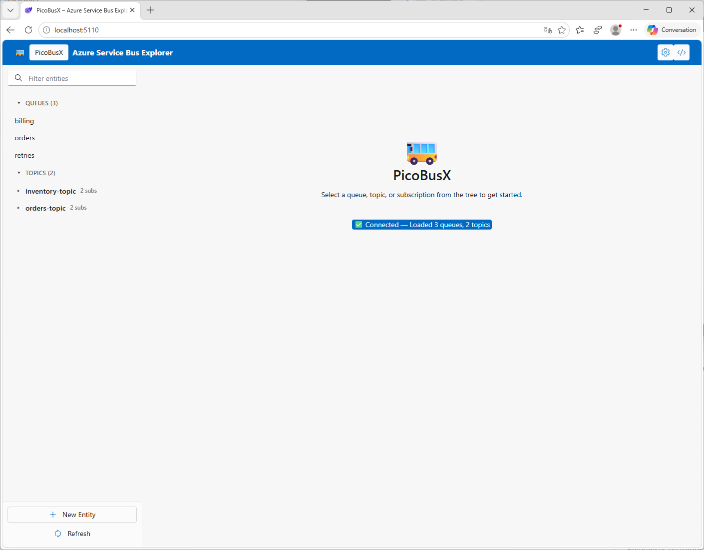
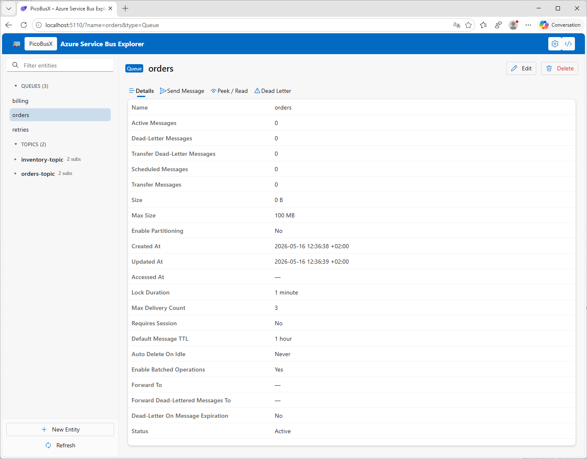
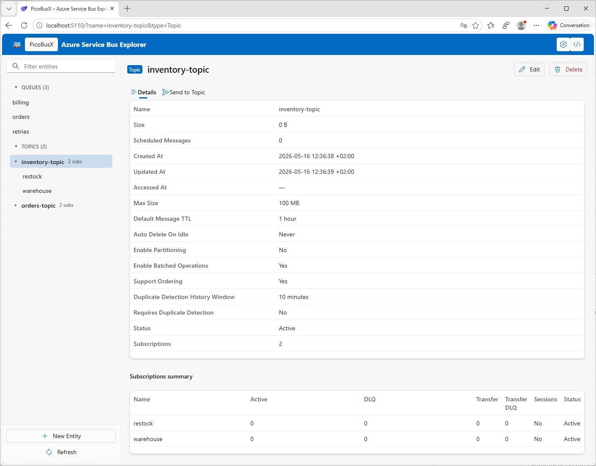
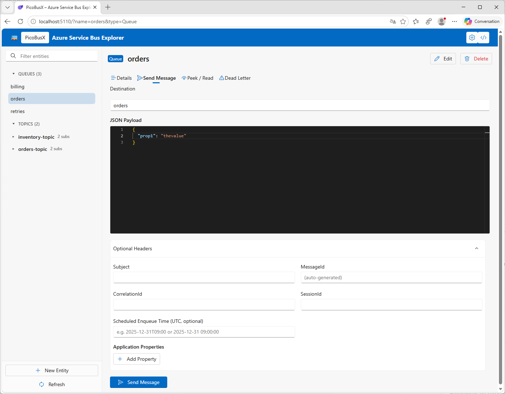
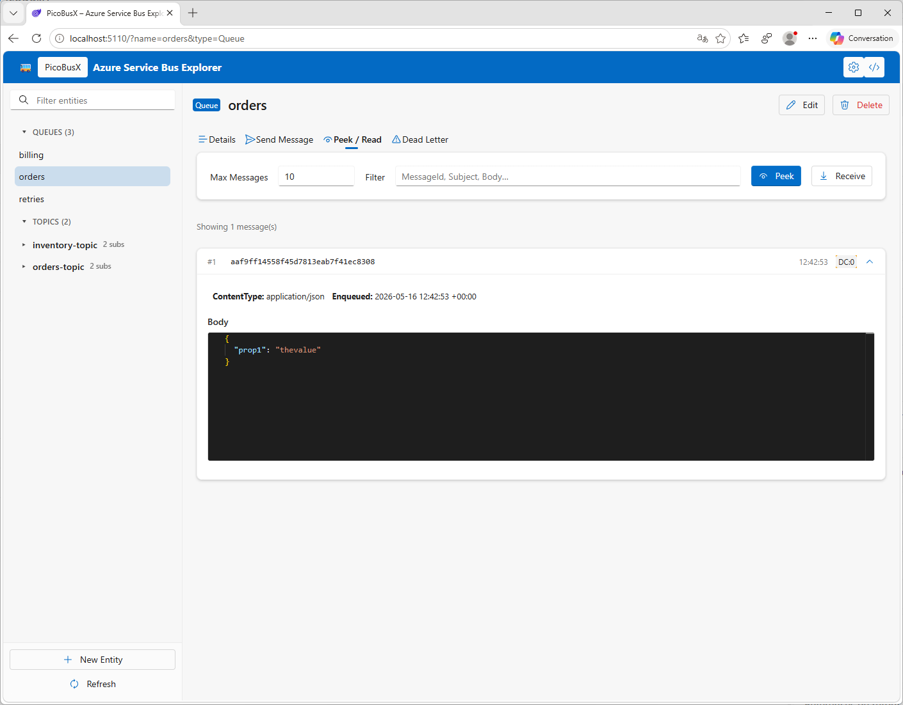
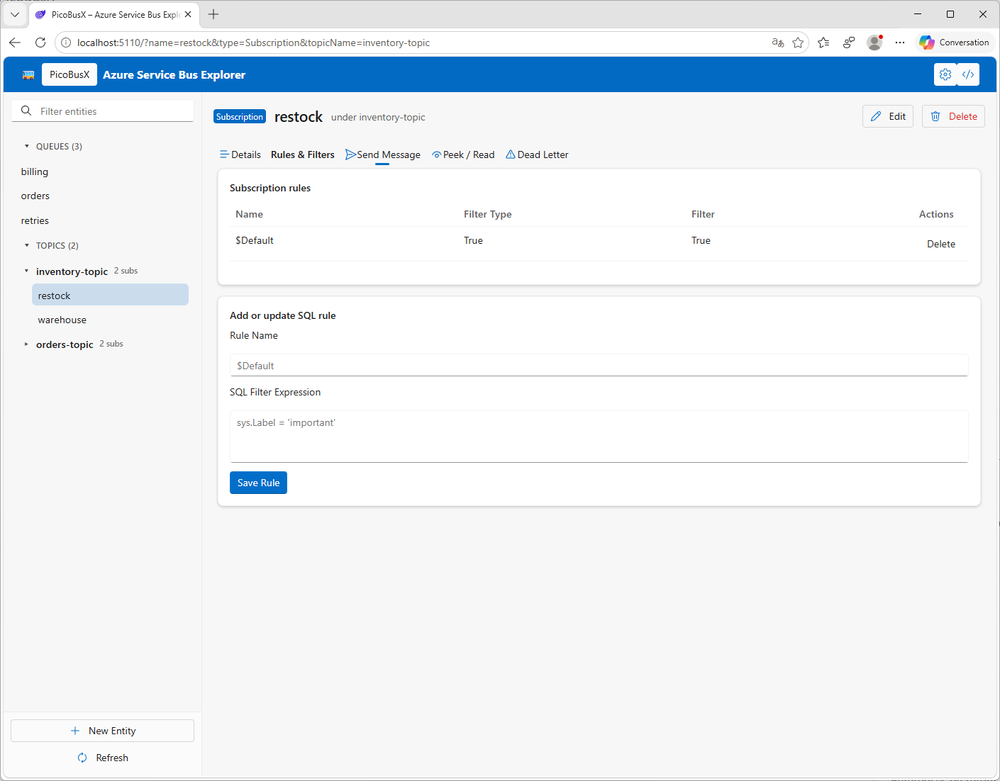
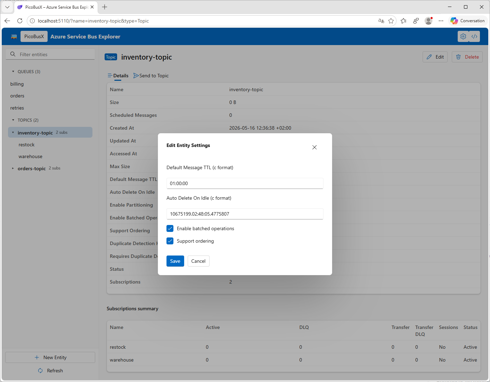
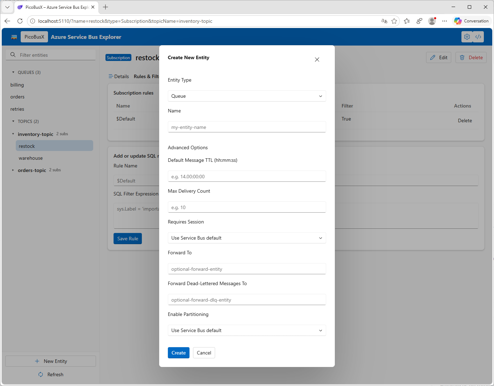
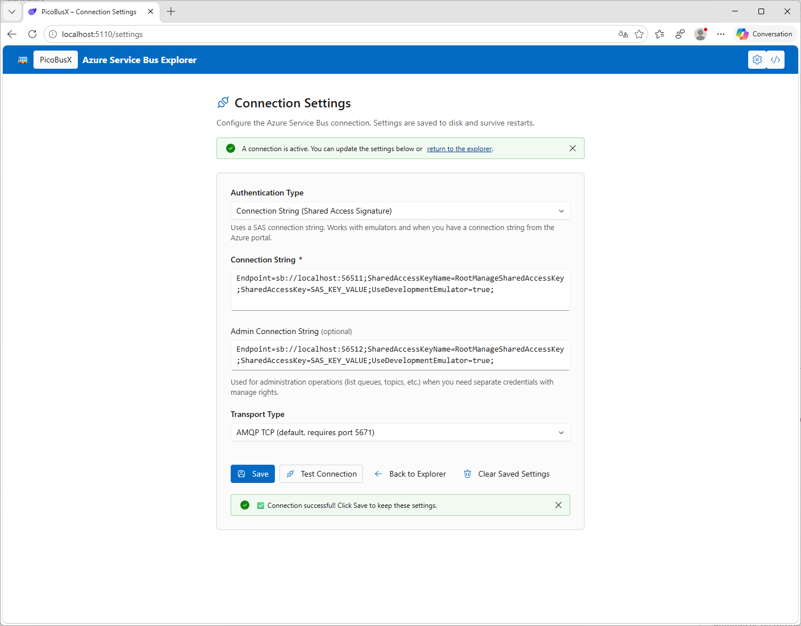

# PicoBusX

🚌 A minimalist **Azure Service Bus Explorer** built with ASP.NET Core Blazor Server (.NET 10).

Built with **Aspire 13.3.3** for local development orchestration and **Microsoft FluentUI Blazor** for a dashboard UI inspired by the .NET Aspire Dashboard.

[](screenshots/home.png)

## Screenshots

### Main Dashboard

[](screenshots/home.png)

### Queue & Topic Details

[](screenshots/queue.png)

[](screenshots/topic.png)

### Send Message

[](screenshots/send_message.png)

### Peek & Read Messages

[](screenshots/peek_read.png)

### Filters

[](screenshots/filters.png)

### Entity Settings

[](screenshots/entity_settings.png)

### New Entity

[](screenshots/new_entity.png)

### Settings / Connection Setup

[](screenshots/settings.png)

---

## Features

- 🌲 **Interactive TreeView** — lists Queues, Topics, and Subscriptions (with filter/search)
- 📋 **Entity Details** — active message count, dead-letter count, lock duration, session info, timestamps
- 📤 **Send Message** — JSON editor with Format / Minify / Validate, optional headers, application properties
- 👁️ **Peek / Read Messages** — non-destructive peek or PeekLock receive, with per-message settlement actions (complete, abandon, defer, dead-letter)
- ✅ **Connection Status** — banner showing connected/not-connected with error details

---

## Prerequisites

- [.NET 10 SDK](https://dotnet.microsoft.com/download/dotnet/10.0) or later
- An Azure Service Bus namespace with a connection string (Standard or Premium tier)
- (Optional) [Docker Desktop](https://www.docker.com/products/docker-desktop) for running with Aspire

---

## How to Run

### Option 1: Using Aspire Host (Recommended for Development)

Aspire automatically orchestrates PicoBusX with a local Azure Service Bus Emulator.

**Prerequisites:**
- Install [.NET Aspire workload](https://learn.microsoft.com/en-us/dotnet/aspire/setup-tooling?tabs=windows):
  ```bash
  dotnet workload install aspire
  ```
- Docker Desktop must be running

**Using Visual Studio / Rider:**
1. Open `PicoBusX.slnx`
2. Set `PicoBusX.AppHost` as the startup project
3. Press `F5`

**Using dotnet CLI:**
```bash
cd src/PicoBusX.AppHost
dotnet run
```

The **Aspire Dashboard** opens at `http://localhost:4317`, showing the PicoBusX web app, the Azure Service Bus Emulator, traces, and logs.

Then visit: **http://localhost:5000** (or the endpoint shown in the dashboard).

### Option 2: Manual Setup (Standalone)

```bash
# Clone the repo
git clone https://github.com/evilz/PicoBusX.git
cd PicoBusX

# Set your connection string via user secrets
dotnet user-secrets set "ServiceBus:SERVICEBUS_CONNECTIONSTRING" "<your-connection-string>" \
  --project src/PicoBusX.Web/PicoBusX.Web.csproj

# Start the app
dotnet run --project src/PicoBusX.Web/PicoBusX.Web.csproj
```

Then open [https://localhost:7270](https://localhost:7270).

### Run tests

```bash
dotnet test tests/PicoBusX.Web.Tests/PicoBusX.Web.Tests.csproj
```

---

## Architecture

```
PicoBusX.AppHost (Aspire Host - Orchestration) [.NET 10 + Aspire 13.3.3]
├── serviceBus (Azure Service Bus Emulator running in Docker)
└── picobusx (PicoBusX Web Application)
    └── references → serviceBus
```

| Resource | Type | Description |
|----------|------|-------------|
| `serviceBus` | Azure Service Bus Emulator | Runs in Docker container for local development |
| `picobusx` | Blazor Server Web App | PicoBusX web frontend, connected to Service Bus |

### How It Works under Aspire

1. **Service Discovery** — The connection string to the Service Bus Emulator is automatically injected into PicoBusX via `ConnectionStrings:serviceBus` and `SERVICEBUS_ADMINCONNECTIONSTRING` environment variables.
2. **Dependency Management** — PicoBusX waits for the Service Bus Emulator to be ready before starting (`WaitFor`).
3. **Local Emulation** — The emulator runs in a Docker container on two ports: `5672` (AMQP messaging) and `5300` (HTTP management REST API).
4. **Client Integration** — `Aspire.Azure.Messaging.ServiceBus` registers a typed `ServiceBusClient` in DI; the custom `ServiceBusClientFactory` manages both messaging and administration clients.

### Aspire Package Versions

| Package | Version |
|---------|---------|
| `Aspire.Hosting` | 13.3.3 |
| `Aspire.Hosting.Azure.ServiceBus` | 13.3.3 |
| `Aspire.Azure.Messaging.ServiceBus` | 13.3.3 |

---

## Environment Variables

| Variable | Required | Default | Description |
|---|---|---|---|
| `ServiceBus__SERVICEBUS_CONNECTIONSTRING` | ✅ Yes | — | Azure Service Bus connection string |
| `ServiceBus__TransportType` | No | `AmqpTcp` | `AmqpTcp` or `AmqpWebSockets` |
| `ServiceBus__EntityMaxPeek` | No | `10` | Default max messages for Peek/Receive |

### Alternative: appsettings.json

```json
{
  "ServiceBus": {
    "SERVICEBUS_CONNECTIONSTRING": "Endpoint=sb://YOUR_NAMESPACE.servicebus.windows.net/;...",
    "TransportType": "AmqpTcp",
    "EntityMaxPeek": 10
  }
}
```

> **⚠️ Never commit credentials to source control.** Prefer environment variables or user secrets for local development.

---

## CI/CD Pipeline

The project uses GitHub Actions to **build**, **test**, and **publish a Docker image** to GitHub Container Registry (`ghcr.io`) on every push to `main`.

- [GitHub Actions workflow](.github/workflows/ci.yml) — two-job pipeline: build & test, then Docker build & push
- [Dockerfile](Dockerfile) — multi-stage build: `sdk:10.0` → `aspnet:10.0`, port 8080
- [.dockerignore](.dockerignore) — excludes build artifacts, tests, and VCS metadata

The workflow publishes to `ghcr.io/<owner>/picobusx` with tags: `latest` (main branch), branch name, and `sha-<commit>`.

```bash
docker run \
  -e ServiceBus__SERVICEBUS_CONNECTIONSTRING="<your-connection-string>" \
  -p 8080:8080 \
  ghcr.io/evilz/picobusx:latest
```

---

## Project Structure

```
src/
├── PicoBusX.AppHost/          # Aspire Host (.NET 10 + Aspire 13.3.3)
│   ├── AppHost.cs             # Aspire orchestration: emulator + web project wiring
│   └── ServiceBusResourceBuilderExtensions.cs  # Admin connection string builder
│
└── PicoBusX.Web/              # Blazor Server (.NET 10)
    ├── Components/
    │   ├── Pages/
    │   │   └── Home.razor             # Main dashboard (tree + details + send + peek)
    │   ├── Layout/
    │   │   └── MainLayout.razor       # Minimal dark-header layout
    │   ├── BusTreeView.razor          # Collapsible tree with search
    │   ├── EntityDetailsPanel.razor   # Queue/Topic/Subscription property tables
    │   ├── JsonMessageEditor.razor    # JSON textarea editor (format/minify/validate)
    │   └── PeekReadPanel.razor        # Peek / Receive message browser
    ├── Models/                        # QueueInfo, TopicInfo, BrowsedMessage, etc.
    ├── Options/
    │   └── ServiceBusConnectionOptions.cs
    ├── Services/
    │   ├── ServiceBusClientFactory.cs # Singleton client/admin client factory
    │   ├── ExplorerService.cs         # List entities + runtime properties
    │   ├── MessageSenderService.cs    # Send JSON messages
    │   └── MessageBrowserService.cs   # Peek / Receive messages
    ├── Program.cs
    └── appsettings.json
```

---

## Troubleshooting

### Docker not running

```bash
docker ps
```

Ensure Docker Desktop is running before starting the Aspire host.

### Service Bus Emulator fails to start

Check if ports `5671`/`5672` (AMQP) and `5300` (HTTP management) are available on your machine.

### Connection string errors

When running under Aspire, the injected connection string looks like:

```
Endpoint=sb://localhost:<port>;SharedAccessKeyName=...;SharedAccessKey=...;UseDevelopmentEmulator=true
```

---

## Known Limits

- **No Azure AD / Managed Identity** support yet — only connection-string auth (SAS)
- **Peek is non-destructive** — uses `PeekMessages`; Receive uses PeekLock and lets you settle each received message from the UI
- **No dead-letter browser** — to peek DLQ, set entity path to `<queue>/$DeadLetterQueue`
- **No message filtering** — peek returns next N messages from the head of the queue/subscription
- **No reconnect / retry UI** — restart the app if the connection string changes
- **Sessions** — session-enabled queues/subscriptions are browsed via session receivers; multiple sessions are sampled up to the requested message count

---

## Contributing

Contributions are welcome! Open an issue or submit a pull request.

## License

MIT
